# VibesFlow RawChunks Backend

EC2+Serverless+DynamoDB backend architecture for collecting, chunking and compressing real-time audio chunks from Lyria (from the Expo app).

Chunks and their metadata are queued for automatic processing and uploading to Filecoin through SynapseSDK.

## Synapse SDK Integration

### Backend Storage (`backend/rawchunks/synapseSDK.js`)

We integrate the Synapse SDK to store vibestream data on Filecoin using Proof of Data Possession (PDP). Each Real-Time Audio session gets a unique RTA_ID and corresponding proof set.

**Our Implementation**:
- Creates dedicated proof sets per RTA_ID for organized storage
- Handles USDFC payments and Pandora service approvals automatically
- Compresses 60-second audio chunks using WebM/Opus encoding
- Stores temporary metadata in DynamoDB for "hot" retrieval

**vs Standard Synapse Usage**:
- Standard: Single proof set for all user data
- VibesFlow: One proof set per vibestream for granular access control
- Standard: Manual payment management
- VibesFlow: Automated payment setup with intelligent batching

```mermaid
graph LR
    RTA[🎵 RTA Session] --> Chunker[📦 60s Chunks]
    Chunker --> Compress[🗜️ WebM Compression]
    Compress --> Synapse[📡 Synapse SDK]
    
    subgraph "Filecoin Storage"
        Synapse --> ProofSet[🛡️ Proof Set]
        ProofSet --> Storage[💾 PDP Storage]
    end
    
    Synapse --> DynamoDB[🗃️ Metadata DB]
    Storage --> FilCDN[⚡ FilCDN Ready]
```

See [App's README](https://github.com/VibesFlow/app/README.md) to read about the whole system.